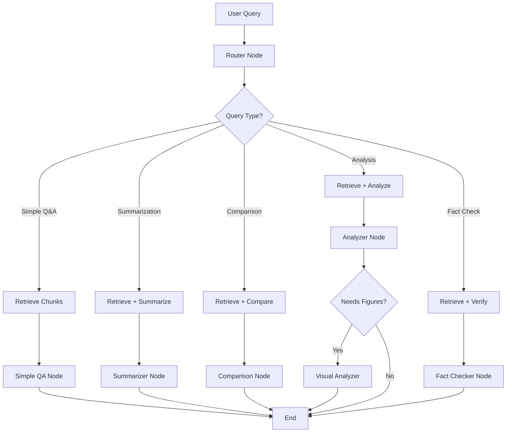

# ArXiv Insight Engine

<div align="center">


**An Advanced Multimodal RAG System with Voice Interaction and Real-time Monitoring**

*AI-Powered Research Assistant for Exploring Academic Papers*

[Features](#-key-features) • [Architecture](#-architecture) • [Installation](#-installation) • [Usage](#-usage)

</div>

## Overview

**ArXiv Insight Engine** is a cutting-edge **Multimodal Retrieval-Augmented Generation (RAG)** system designed to revolutionize how researchers interact with academic papers. Built with state-of-the-art AI technologies, it combines document processing, intelligent routing, voice interaction, and comprehensive monitoring to create a powerful research assistant.

## Key features

| Feature | Description |
| --- | --- |
| Intelligent Query Routing | Automatically classifies queries and routes them to specialized processing nodes |
| **Voice-First Interface** | Complete speech-to-text and text-to-speech integration |
| **Multimodal Understanding** | Analyzes figures, tables, and visual content from papers |
| **Real-time Monitoring** | Track costs, latency, and performance metrics |
| **Papers Management** | Browse, view, and manage your research paper database |
| **Hybrid Retrieval** | Combines dense vector search with BM25 for optimal results |

## Technology stack
```yaml
Backend:
  Framework: FastAPI 0.110+
  ASGI Server: Uvicorn
  Python: 3.11+
  
AI/ML Stack:
  LLM Framework: LangChain 0.1+
  Orchestration: LangGraph
  LLM: Meta Llama 3.3 70B Instruct (via HuggingFace)
  Embeddings: all-MiniLM-L6-v2 (SentenceTransformers)

Vector Database:
  Primary: ChromaDB (persistent)
  Search Algorithm: HNSW with cosine similarity
  
Document Processing:
  Parser: Unstructured.io
  Text Splitter: LangChain RecursiveCharacterTextSplitter
  
Retrieval:
  Hybrid: ChromaDB (dense) + BM25 (sparse)
  Fusion: Reciprocal Rank Fusion (RRF)

Voice Processing:
  STT: OpenAI Whisper (base/medium/large)
  TTS: Google Text-to-Speech (gTTS)
  Audio Format: WAV, MP3, WebM, M4A
  
Vision:
  Image Captioning: Salesforce BLIP-Large
  Processing: PIL, Base64 encoding
  
Text:
  Summarization: Facebook BART-Large-CNN
  Tokenization: HuggingFace Transformers

UI Framework: Vanilla JavaScript
Styling: Custom CSS with CSS Variables
Icons: Lucide Icons
Charts: Chart.js
Components:
  - Dynamic modals
  - Real-time updates
  - Drag-and-drop upload
  - Voice recording interface

Metrics:
  Storage: JSONL file-based persistence
  Tracking: Custom metrics_tracker module
  Visualization: Chart.js + Plotly
  
Optional:
  LangSmith: For advanced tracing
  LangChain Callbacks: Operation logging
```
## Architecture

### System architecture

```
┌─────────────────────────────────────────────────────────────┐
│                     Frontend (Browser)                      │
│  ┌──────────┐  ┌──────────┐  ┌──────────┐  ┌───────────┐    │
│  │   Chat   │  │  Voice   │  │  Papers  │  │ Metrics   │    │
│  │    UI    │  │  Panel   │  │  Manager │  │ Dashboard │    │
│  └────┬─────┘  └────┬─────┘  └────┬─────┘  └─────┬─────┘    │
└───────┼─────────────┼─────────────┼──────────────┼──────────┘
        │             │             │              │
        └─────────────┴─────────────┴──────────────┘
                            │
                    ┌───────▼────────┐
                    │   FastAPI      │
                    │   Backend      │
                    └───────┬────────┘
                            │
        ┌───────────────────┼─────────────────┐
        │                   │                 │
   ┌────▼─────┐      ┌──────▼─────┐     ┌─────▼────┐
   │  Voice   │      │  LangGraph │     │ ChromaDB │
   │ Handler  │      │   Agent    │     │  Store   │
   └──────────┘      └──────┬─────┘     └──────────┘
                            │
        ┌───────────────────┼─────────────────┐
        │                   │                 │
   ┌────▼─────┐      ┌──────▼─────┐     ┌─────▼────┐
   │ Whisper  │      │   Router   │     │   BM25   │
   │   STT    │      │    Node    │     │ Retriever│
   └──────────┘      └──────┬─────┘     └──────────┘
                            │
        ┌───────────────────┼────────────────┐
        │        │          │       │        │
   ┌────▼───┐ ┌──▼──┐ ┌─────▼─┐ ┌───▼───┐ ┌──▼──┐
   │Simple  │ │Sum- │ │Compare│ │Analyze│ │Fact │
   │  Q&A   │ │mary │ │       │ │       │ │Check│
   └────────┘ └─────┘ └───────┘ └───────┘ └─────┘
```

### LangGraph workflow


```mermaid
graph TD
    A[User Query] --> B[Router Node]
    B --> C{Query Type?}
    C -->|Simple Q&A| D[Retrieve Chunks]
    C -->|Summarization| E[Retrieve + Summarize]
    C -->|Comparison| F[Retrieve + Compare]
    C -->|Analysis| G[Retrieve + Analyze]
    C -->|Fact Check| H[Retrieve + Verify]
    
    D --> I[Simple QA Node]
    E --> J[Summarizer Node]
    F --> K[Comparison Node]
    G --> L[Analyzer Node]
    L --> M{Needs Figures?}
    M -->|Yes| N[Visual Analyzer]
    M -->|No| O[End]
    H --> P[Fact Checker Node]
    
    I --> O
    J --> O
    K --> O
    N --> O
    P --> O
```

## Installation

**Prerequisites**

```bash
# System Requirements
- Python 3.11+
- 8GB+ RAM (16GB recommended)
- 10GB+ disk space
- CUDA-capable GPU (optional, for faster processing)

# System Dependencies
- ffmpeg (for audio processing)
- git
```

**Set up**
```bash
git clone https://github.com/0Nguyen0Cong0Tuan0/arxiv-insight-engine.git
cd arxiv-insight-engine

# Using venv
python -m venv venv
venv\Scripts\activate # Windows
source venv/bin/activate # Linux/Mac

# Install all requirements
pip install -r requirements.txt

# Install ffmpeg (required for audio)
# Ubuntu/Debian:
sudo apt-get install ffmpeg

# macOS:
brew install ffmpeg

# Windows:
# Download from https://ffmpeg.org/download.html

# Create .env file
cp .env.example .env

# Edit .env with your API keys
nano .env
```
### Required environment variables
```env
# Hugging Face API Token (Required)
HUGGINGFACEHUB_API_TOKEN=your_token_here

# Optional (for advanced features)
LANGCHAIN_API_KEY=your_langsmith_key
LANGCHAIN_TRACING_V2=false
```

### Initialize Database

```bash
# Create necessary directories
mkdir -p data/raw_papers data/processed chroma_db

# Initialize ChromaDB (automatically on first run)
python -c "from src.stores.vector_store import init_collection; init_collection()"
```

### Run the Application

```bash
# Start the FastAPI server
uvicorn src.app.main:app --reload --host 0.0.0.0 --port 8000

# Access the application
# Main UI: http://localhost:8000
# Metrics Dashboard: http://localhost:8000/metrics.html
# API Docs: http://localhost:8000/docs
```

### Result

**Home**


**Metric Dashboard**


## Usage

### Upload PDF papers

```bash
# Via Web UI
1. Click "Upload" tab
2. Drag & drop PDFs or click to browse
3. Click "Upload & Process"
4. Wait for processing to complete

# Via API
curl -X POST "http://localhost:8000/api/ingest/upload" \
  -F "files=@paper1.pdf" \
  -F "files=@paper2.pdf"
```

### Search ArXiv papers

```bash
# Via Web UI
1. Click "Search" tab
2. Enter query (e.g., "Large Language Models")
3. Select papers from results
4. Click "Ingest Selected Papers"

# Via API
curl -X POST "http://localhost:8000/api/arxiv/search" \
  -H "Content-Type: application/json" \
  -d '{"query": "RAG systems", "max_results": 10}'
```

### Ask questions (Text)

```bash
# Via Web UI
1. Type question in chat input
2. Press Enter or click Send
3. View response with sources

# Via API
curl -X POST "http://localhost:8000/api/query/text" \
  -H "Content-Type: application/json" \
  -d '{"query": "What is retrieval augmented generation?"}'
```

### Use voice assistant

```bash
# Via Web UI
1. Click "Voice Toggle" in header to enable
2. Click "Record Voice Query"
3. Speak your question
4. Click "Stop Recording"
5. Listen to response (auto-play enabled)
```

### Manage papers

```bash
# Via Web UI
1. Click "Manage Papers" in header
2. View all indexed papers
3. Select papers to delete
4. Click "Delete Selected"

# Via API
# List papers
curl http://localhost:8000/api/papers/list

# Delete papers
curl -X DELETE http://localhost:8000/api/papers/delete \
  -H "Content-Type: application/json" \
  -d '["paper_id1", "paper_id2"]'
```

### View metrics

```bash
# Via Web UI
1. Click "View Metrics Dashboard" link
2. Select time range (1h, 6h, 24h, 7d)
3. View charts and statistics
4. Export metrics if needed

# Via API
curl http://localhost:8000/api/metrics/dashboard?hours=24
```

## API documentation

### Document ingestion

```http
POST /api/ingest/upload
Content-Type: multipart/form-data

files: PDF file(s)

Response:
{
  "success": true,
  "message": "Processed 2 files",
  "files": [
    {
      "filename": "paper.pdf",
      "paper_id": "paper",
      "chunks_added": 150
    }
  ]
}
```

### ArXiv integration

```http
POST /api/arxiv/search
Content-Type: application/json

{
  "query": "neural networks",
  "max_results": 10
}

Response:
{
  "success": true,
  "count": 10,
  "results": [...]
}
```

```http
POST /api/arxiv/ingest
Content-Type: application/json

{
  "paper_ids": ["2301.00001", "2301.00002"]
}

Response:
{
  "success": true,
  "papers": [...],
  "successful": 2,
  "failed_count": 0
}
```

### Query processing

```http
POST /api/query/text
Content-Type: application/json

{
  "query": "Explain transformer architecture",
  "image_base64": null  // optional
}

Response:
{
  "response": "The transformer architecture...",
  "sources": [
    {
      "paper_id": "paper_123",
      "content": "..."
    }
  ],
  "image_caption": null
}
```

### Voice operations

```http
POST /api/voice/transcribe
Content-Type: multipart/form-data

audio: audio file (WAV, MP3, WebM, M4A)

Response:
{
  "success": true,
  "text": "What is attention mechanism",
  "latency": 2.5
}
```

```http
POST /api/voice/synthesize
Content-Type: application/x-www-form-urlencoded

text=Hello world&lang=en

Response: audio/mpeg stream
```

```http
POST /api/voice/query
Content-Type: multipart/form-data

audio: audio file

Response:
{
  "success": true,
  "transcribed_text": "What is RAG",
  "response_text": "RAG stands for...",
  "audio_base64": "...",
  "latency": 10.5,
  "route": "simple_qa"
}
```

### Papers management

```http
GET /api/papers/list

Response:
{
  "success": true,
  "papers": [
    {
      "paper_id": "paper_123",
      "title": "Paper Title",
      "chunk_count": 150,
      "total_size": 125000
    }
  ],
  "total_papers": 5,
  "total_chunks": 750
}
```

```http
DELETE /api/papers/delete
Content-Type: application/json

["paper_id1", "paper_id2"]

Response:
{
  "success": true,
  "message": "Deleted 2 papers",
  "chunks_deleted": 300
}
```

### Metrics

```http
GET /api/metrics/summary?hours=24

Response:
{
  "success": true,
  "data": {
    "total_operations": 150,
    "success_rate": 98.5,
    "avg_latency": 3.2,
    "total_cost": 0.0245
  }
}
```

```http
GET /api/metrics/dashboard?hours=24

Response:
{
  "success": true,
  "summary": {...},
  "operations": {...},
  "recent_errors": [...],
  "insights": {...}
}
```
## Project structure

```
arxiv-insight-engine/
├── src/
│   ├── agents/
│   │   ├── nodes/              # LangGraph processing nodes
│   │   │   ├── analyzer.py     # Deep analysis node
│   │   │   ├── comparison.py   # Comparison analysis
│   │   │   ├── fact_checker.py # Fact verification
│   │   │   ├── retriever.py    # Hybrid retrieval
│   │   │   ├── router.py       # Query classification
│   │   │   ├── simple_qa.py    # Q&A processing
│   │   │   ├── summarizer.py   # Summarization
│   │   │   ├── synthesizer.py  # Cross-paper synthesis
│   │   │   └── visual_analyzer.py # Figure analysis
│   │   ├── tools/
│   │   │   ├── hybrid_retriever.py  # Vector + BM25
│   │   │   ├── image_captioner.py   # BLIP captioning
│   │   │   └── summarizer.py        # BART summarization
│   │   └── graph.py            # LangGraph orchestration
│   ├── app/
│   │   ├── static/
│   │   │   ├── css/
│   │   │   │   ├── variables.css    # CSS variables
│   │   │   │   ├── base.css         # Base styles
│   │   │   │   ├── components.css   # UI components
│   │   │   │   ├── animations.css   # Animations
│   │   │   │   ├── voice.css        # Voice UI
│   │   │   │   └── papers.css       # Papers manager
│   │   │   └── js/
│   │   │       ├── api.js           # API client
│   │   │       ├── chat.js          # Chat interface
│   │   │       ├── main.js          # Main app logic
│   │   │       ├── search.js        # ArXiv search
│   │   │       ├── state.js         # State management
│   │   │       ├── upload.js        # File upload
│   │   │       ├── voice.js         # Voice assistant
│   │   │       └── papers.js        # Papers manager
│   │   ├── templates/
│   │   │   ├── index.html           # Main UI
│   │   │   └── metrics.html         # Metrics dashboard
│   │   ├── main.py                  # FastAPI application
│   │   └── voice_handler.py         # Voice processing
│   ├── embeddings/
│   │   └── embedder.py              # Embedding generation
│   ├── ingest/
│   │   ├── loader/
│   │   │   └── arxiv_loader.py      # ArXiv integration
│   │   ├── parser/
│   │   │   └── multimodal_parser.py # PDF parsing
│   │   ├── pipeline.py              # Ingestion pipeline
│   │   └── processor.py             # Document processing
│   ├── models/
│   │   ├── document.py              # Document models
│   │   └── request.py               # API models
│   ├── monitoring/
│   │   └── metrics_tracker.py       # Metrics collection
│   └── stores/
│       ├── feedback_store.py        # User feedback
│       └── vector_store.py          # ChromaDB interface
├── chroma_db/                       # Vector database
├── config.py                        # Configuration
├── requirements.txt                 # Dependencies
└── README.md                        # This file
```
